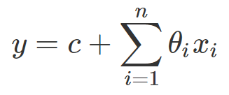

# Regression Algorithms
Some examples of Regression algorithms using Python.

## Regression problem

The overall idea of regression is to examine two things: 

1. does a set of predictor variables do a good job in predicting an outcome (dependent) variable?
2. Which variables in particular are significant predictors of the outcome variable, and in what way do they–indicated by the magnitude and sign of the beta estimates–impact the outcome variable?

### Linear Regression (One or more variables)

The simplest form of the regression equation with one dependent and one or more independent variables, defined by the formula below, where y = estimated dependent variable score, c = constant, tetha = regression coefficient, and x = score on the independent variable.

- One Variable Linear Regression on file **linear_regression.py**;

- The example algorithm can be found in the file **multiple_linear_regression.py**;

### Polynomial Regression

Polynomial regression is a form of regression analysis in which the relationship between the independent variable x and the dependent variable y is modeled as an nth degree polynomial in x. Polynomial regression fits a nonlinear relationship between the value of x and the corresponding conditional mean of y.

- The example algorithm can be found in the file **polynomial_linear_regression.py**;

### Support Vector Regression (SVR)

a support vector machine constructs a hyperplane or set of hyperplanes in a high- or infinite-dimensional space, which can be used for classification, regression, or other tasks like outliers detection. Intuitively, a good separation is achieved by the hyperplane that has the largest distance to the nearest training-data point of any class (so-called functional margin), since in general the larger the margin the lower the generalization error of the classifier.

- The example algorithm can be found in the file **svr.py**;

### Decision Tree Regression

Decision tree learning uses a decision tree (as a predictive model) to go from observations about an item (represented in the branches) to conclusions about the item's target value (represented in the leaves). It is one of the predictive modelling approaches used in statistics, data mining and machine learning. Tree models where the target variable can take a discrete set of values are called classification trees; in these tree structures, leaves represent class labels and branches represent conjunctions of features that lead to those class labels. Decision trees where the target variable can take continuous values (typically real numbers) are called regression trees.

- The example algorithm can be found in the file **decision_tree_regression.py**;

### Random Forest Regression

Random forests or random decision forests are an ensemble learning method for classification, regression and other tasks, that operate by constructing a multitude of decision trees at training time and outputting the class that is the mode of the classes (classification) or mean prediction (regression) of the individual trees. Random decision forests correct for decision trees' habit of over fitting to their training set.

- The example algorithm can be found in the file **random_forest_regression.py**;

### Pros and cons about regression algorithms

Algorithm | Pros | Cons
------------ | ------------- | -------------
Linear Regression | Works on any size of dataset, gives informations about relevance of features | The Linear Regression Assumptions
Polynomial Regression | Works on any size of dataset, works very well on non linear problems | Need to choose the right polynomial degree for a good bias/variance tradeoff
SVR | Easily adaptable, works very well on non linear problems, not biased by outliers | Compulsory to apply feature scaling, not well known, more difficult to understand
Decision Tree Regression | Interpretability, no need for feature scaling, works on both linear / nonlinear problems | Poor results on too small datasets, overfitting can easily occur
Random Forest Regression | Powerful and accurate, good performance on many problems, including non linear | No interpretability, overfitting can easily occur, need to choose the number of trees